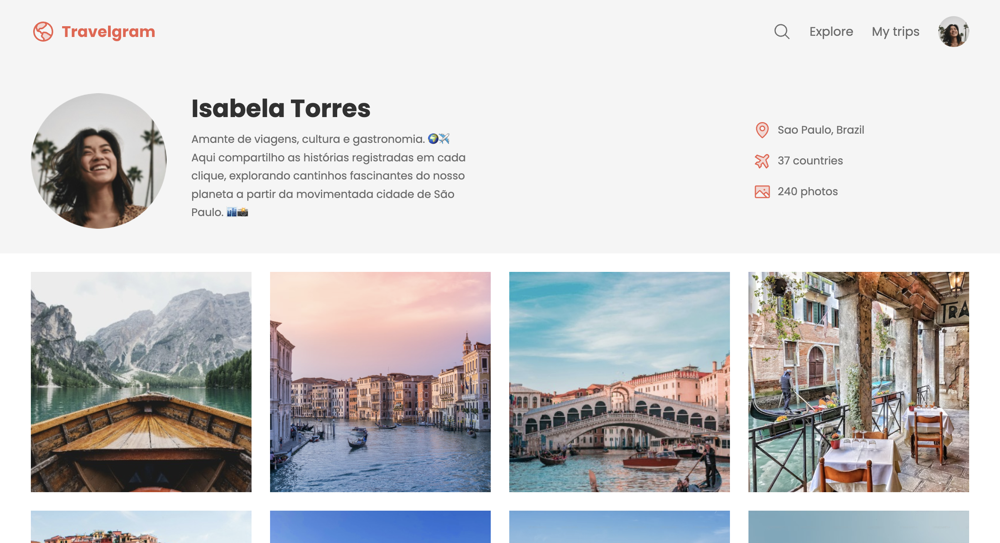

# Travelgram

Travelgram is a practice project focused on design and front-end development using HTML and CSS. It demonstrates a visually appealing interface for a hypothetical travel-sharing platform.



🌐 [Live Demo](https://github.com/rodrigovaladao/project-travelgram)

## Features

- **Responsive Design:** Optimised for desktop and mobile devices.
- **Clean Layout:** Focuses on aesthetics and user experience.
- **Static Content:** HTML and CSS implementation without back-end functionality.

## Technologies Used

- **HTML5:** Structure and layout of the project.
- **CSS3:** Styling and responsiveness.

## Installation

To view the project locally:

1. Clone the repository:
   ```bash
   git clone https://github.com/rodrigovaladao/project-travelgram.git
   ```
